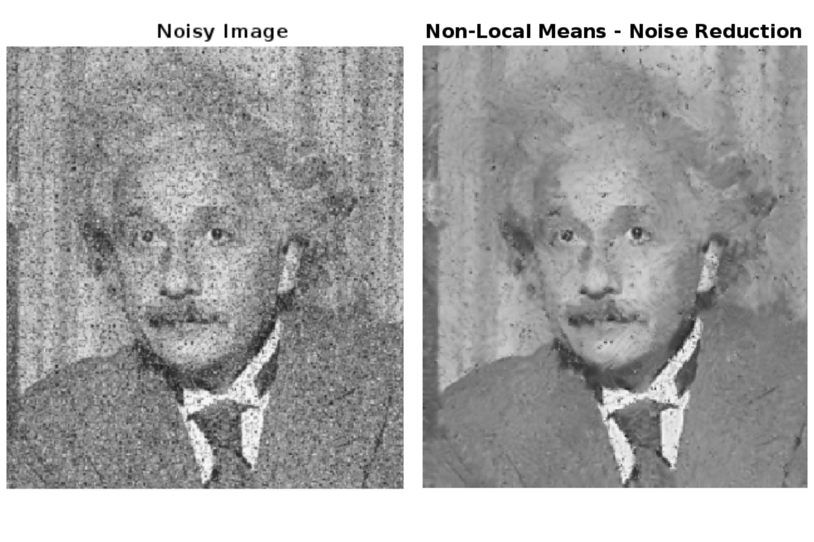

# Noise Reduction in MATLAB

This MATLAB script provides a simple and interactive way to apply various noise reduction filters to an input image. Users can upload an image, choose a noise reduction filter, and visualize the results.

## Using the Script on GitHub

    1. Clone the repository: Download the code files to your local machine.
    2. Open the script in MATLAB: Navigate to the script file and open it in the MATLAB Live Editor.
    3. Run the script: Click the "Run" button in the Editor.
    4. Provide inputs: The script will prompt you for input choices through live controls:
        - Upload image path
        - Display noisy image (true/false)
        - Noise reduction filter choice
    5. View results: The script displays the noisy image (if selected) and the filtered image with the chosen filter applied.
    6. Save the processed image: The script automatically saves the filtered image with a new name in the same directory as the original image.

## Dependencies

The script uses built-in MATLAB functions for image processing. No additional toolboxes or external libraries are required.

We hope this script empowers you to explore image denoising and find the perfect filter for your needs! 
Thank you for exploring this script. Happy coding!
